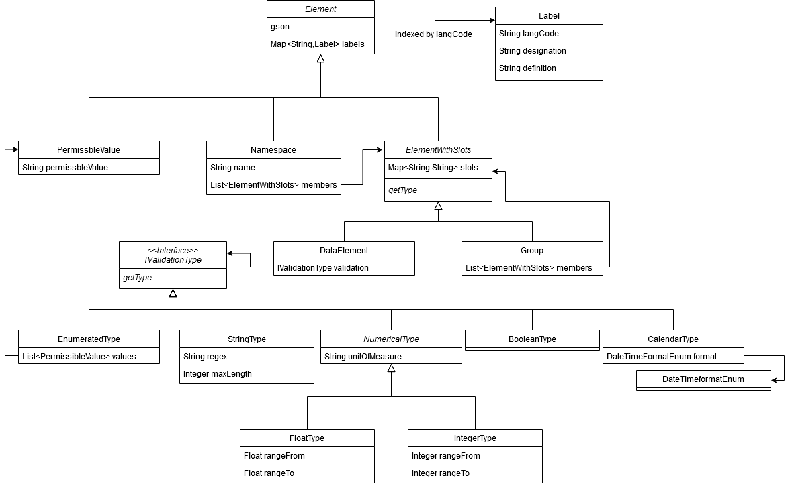

# MDRtools-model
Java classes representig the Samply.MDR metadata objects

Example Usage:

```java
DataElement de = new DataElement();
de.setLabel("de","Test","Dies ist ein Test-Datenelement mit true/false Wert");
de.setValidation(new BooleanType());

DataElement deEnum = new DataElement();
deEnum.setLabel("en","Enumerated Test","Thus test element has an enumerated value domain");
EnumeratedType mdrenum = new EnumeratedType();
deEnum.setValidation(mdrEnum);
PermissibleValue val1 = new PermissbleValue("A");
val1.setLabel("en", "A", "value A");
mdrenum.addValue(val1);

Group group = new Group();
group.setLabel("en","test group","this is a test group");
group.getMembers().add(ge);
group.getMembers().add(deEnum);

Namespace namespace = new Namespace();
namespace.setName("mynamespace");
namespace.getMembers().add(group);

//Get whole namespace as JSON (can be called with all object types, e.g. on Groups or single DataElements)
String json = Element.gson.toJson(namespace);
```

Groups can be nested. Groups and Namespaces can have Groups or DataElements as members. Only one Label per language code is allowed per Element, if one already exists it is overwritten.
Some ValidationTypes have attributes that can be accessed via getters and setters, e.g. StringType can have a Regex, refer to the class diagram.


